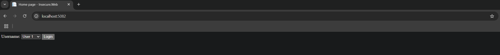
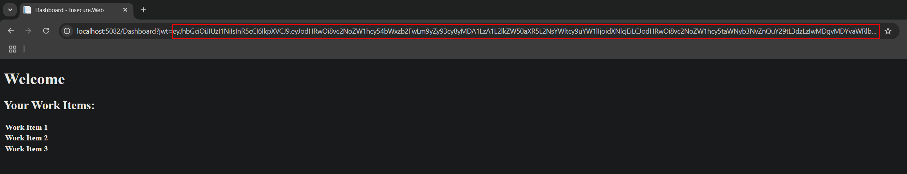
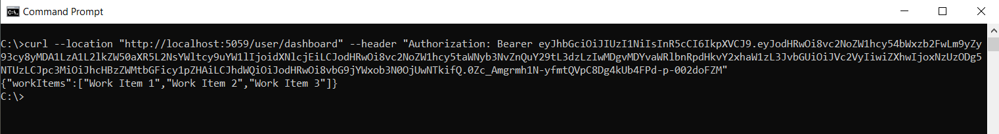

# Missing Function Level Access Control

## Table of Contents
<details>
<summary>Show</summary>

- [Missing Function Level Access Control](#missing-function-level-access-control)
  - [Table of Contents](#table-of-contents)
  - [Summary](#summary)
  - [Lab Application](#lab-application)
    - [Application Flow](#application-flow)
  - [Security Requirements](#security-requirements)
  - [Insecure Version](#insecure-version)
    - [Vulnerability](#vulnerability)
    - [Exploitating Vulnerability](#exploitating-vulnerability)
  - [Secure Version](#secure-version)
  - [Running the App](#running-the-app)
    - [Running the app in Docker containers](#running-the-app-in-docker-containers)
    - [Running the app in Visual Studio](#running-the-app-in-visual-studio)
    - [Running the app using the .NET CLI](#running-the-app-using-the-net-cli)
  - [Further Enhancements](#further-enhancements)
  - [Disclaimer](#disclaimer)
  - [References](#references)
    - [Links](#links)

</details>

## Summary
Missing function level access control occurs when an application fails to properly restrict access to certain functions based on user roles or permissions. In other words, users—whether logged in or not—can access functions or endpoints they should not be able to reach. This oversight can allow unauthorized users to perform privileged actions, access sensitive data, or even take control of critical parts of the application.

## Lab Application
The example app is made up of: 
- An ASP.NET Core Web API app with two endoints: `user/dashboard` and `admin/dashboard`.
- An ASP.NET Core Web App that displays a simple drop down selection with login button with two users to select from- a basic user and an admin user. Once authenticated, a dashboard page is displayed with data from either the `user/dashboard` endpoint, or `admin/dashboard` endpoint depending on which user was selected.
- An ASP.NET Core Web API authentication app with a `/login` endpoint used to simulate login functionality [[1]](#references). 
  
### Application Flow
- Selecting a user from the login dropdown sends a request to the authentication app's `/login` endpoint. 
- An access token is returned from the `/login` endpoint which contains either a `User` or `Admin` role claim. 
- The access token is used in a request to either `user/dashboard` or `admin/dashboard` depending on the role claim.
- The data in the response to `user/dashboard` or `admin/dashboard` is displayed on a dashboard page.
 
## Security Requirements
- The `user/dashboard` can be accessed by any logged in user. 
- The `admin/dashboard` should only be accessible to an admin user only.
- Neither `user/dashboard` or `admin/dashboard` should be accessible to anonymous users.

## Insecure Version 
In the insecure version the two endpoints have been secured with a basic level of authorization -  only authenticated users are allowed to execute the endpoints. This has been implemented by decorating the controller actions with with the `Authorize` attribute: 

```C#
 [Authorize]
 [HttpGet("/admin/dashboard")]
 public Dashboard GetAdminDashboard()
 {
     return new Dashboard
     {
         WorkItems = [
         "Admin Work Item 1",
         "Admin Work Item 2",
         "Admin Work Item 3"
         ]
     };
 }

 [Authorize]
 [HttpGet("/user/dashboard")]
 public Dashboard Get()
 {
     return new Dashboard
     {
         WorkItems = [
         "Work Item 1",
         "Work Item 2",
         "Work Item 3"
         ]
     };
 }
```

### Vulnerability
With the `[Authorize]` attribute applied, if an anonymous user makes a request to `user/dashboard` or `admin/dashboard`, a `401 Unauthorized` response will be returned. However, although the Insecure.Web app does not directly allow a basic user to view the admin dashboard, there is nothing stopping a user logged in as a basic user calling the `admin/dashboard` endpoint directly.
This can be done by simply making a Get request to the endpoint via Curl, or a using an API testing tool like Postman.

### Exploitating Vulnerability
1. Ensure all the individual apps are running (see the [Running the Apps](#running-the-apps) section below)
2. Open a browser and navigate to `http://localhost:5082`
3. Select User 1 from the drop down and click the Login button.
    <details>
    <summary>Show screenshot</summary>
    
    </details>
4. Copy the query string value from the browser address bar (everything after `http://localhost:5082/Dashboard?jwt=`).
    <details>
    <summary>Show screenshot</summary>
    
    </details>
5. Open a command window and execute: `curl --location "http://localhost:5059/user/dashboard" --header "Authorization: Bearer [jwt]"` replacing `[jwt]` with the token you copied from the address bar in step 4. You should get the dashboard items for a basic user as you did when logging in to the Insecure.WEB app.
    <details>
    <summary>Show screenshot</summary>
    
    </details>
6. Execute the Curl command again with the same jwt but this time update the URL to point to the `admin/dashboard` endpoint: `curl --location "http://localhost:5059/admin/dashboard" --header "Authorization: Bearer [jwt]"`. You should now get the dashboard items for the admin user.
    <details>
    <summary>Show screenshot</summary>
    
    </details>

---

## Secure Version
In the secure version of the app Claims-based authorization[[2]](#references) has been used to protect the `admin/dashboard` endpoint from being accessed by any user that doesnt have the `Admin` role claim. This has been implemented by applying the `IsAdmin` policy to the `GetAdminDashboard` action by specifying the policy in the authorize attribute.
```C#
 [Authorize(Policy = "IsAdmin")]
 [HttpGet("/admin/dashboard")]
 public Dashboard GetAdminDashboard()
 {
     return new Dashboard
     {
         WorkItems = [
         "Admin Work Item 1",
         "Admin Work Item 2",
         "Admin Work Item 3"
         ]
     };
 }
```

The policy has been configured in Program.cs as part of the call to `AddAuthorization()` in ConfigureServices.

```C#
builder.Services.AddAuthorization(options =>
{
    options.AddPolicy("IsAdmin", policyBuilder
        => policyBuilder.RequireClaim(ClaimTypes.Role, "Admin"));
});
```
This policy is used by the AuthorizationMiddleware to determine whether the user is allowed to execute the endpoint.
If the user is not authenticated, a 401 Unauthorized response will be returned. If the user is authenticated but doesn't have the required claims, a 403 Forbidden response will be returned.

>For production-grade security see the Further Enhancements section below. 
---

## Running the App
### Running the app in Docker containers
- Open a Windows command window (or terminal if in Linux) in either the [insecure/backend/](./insecure/backend/) folder, or the [secure/backend/](./secure/backend/) folder depending on which version you want to run.
- Execute either `compose-up.bat` in a Windows command window or `compose-up` in a Linux terminal 
- Open a browser window and enter `http://localhost:5082` in the address bar.
- You should be presented with a login drop down selection. 

This is the quickest way to get the app up and running, however if you would like to debug the app and step through the code, see [Running the apps in Visual Studio](#running-the-apps-in-visual-studio) below.

### Running the app in Visual Studio
- First start the **Authentication.API** app by opening an instance of Visual Studio and clicking File/Open/Project/Solution and select the **Appsec-Labs-IDP.sln** located in the [**Authentication.API**](../../../shared/appsec-labs-idp/Authentication.API/) project folder.
- Press F5 to start the Authentication.API project in debugging mode (or click the green run button).
- Next start the Insecure/Secure API and Web apps by opening another instance of Visual Studio and clicking File/Open/Project/Solution and select either **Insecure.sln** or **Secure.sln** located in [/insecure/backend/](./insecure/backend/) or [/secure/backend/](./secure/backend/) depending on which version of the app you'd like to run.
- With the solution open in Visual Studio, right click on the Solution node in Solution Explorer and select **Configure Startup Projects**
- Click on Multiple startup projects.
- Select Start from the Action dropdown for the two projects and click Apply.
- Click Yes to "Do you want to save the changes.."
- Press F5 to start running both projects in debugging mode (or click the green run button).
- Open a browser window and enter `http://localhost:5082` in the address bar.
- You should be presented with a login drop down selection. 

### Running the app using the .NET CLI
- Execute `dotnet run` in a command window in the [**Authentication.API**](../../../shared/appsec-labs-idp/Authentication.API/) project folder
- Execute `dotnet run` in either the [**Insecure.API**](./insecure/backend/src/Insecure.API/) project folder, or the [**Secure.API**](./secure/backend/src/Secure.API/) folder.
- Execute `dotnet run` in either the [**Insecure.WEB**](./insecure/backend/src/Insecure.Web/) project folder, or the [**Secure.WEB**](./secure/backend/src/Secure.Web/) folder.
- Open a browser window and enter `http://localhost:5082` in the address bar.
- You should be presented with a login drop down selection. 

## Further Enhancements

> **Cryptographic Key Storage:**  
> For demonstration purposes, cryptographic keys are generated and stored in configuration.  
> **In production, always use a secure key vault (such as Azure Key Vault or AWS KMS) and implement robust access controls for key management and rotation endpoints.**  
> Ensure that key rotation endpoints are protected with strong authentication and authorization.

> **Logging & Monitoring:**  
> Sensitive endpoints (such as key rotation) should be logged and monitored for unauthorized access attempts.  
> This helps detect and respond to potential security incidents.

## Disclaimer  
>This application is for demonstration and educational purposes only.    
>Do not use these patterns as-is in production.

## References
[1]: Login functionality has been implemented as a simple drop down selection with login button with two users (a basic user and an admin user) hard coded in the Authentication.API app. It has been implemented this way in order to show how the app functions when logging in as different users without needing a complete identity provider solution.

[2]: Claims-based authorization uses the current user’s claims to determine whether they’re authorized to execute an action. You define the claims needed to execute an action in a policy. Claims-based authorization enforces access control at the function level, not just authentication. This ensures that only users with the correct role or permission can access sensitive endpoints, reducing the risk of privilege escalation. This approach aligns with [OWASP ASVS](https://owasp.org/www-project-application-security-verification-standard/) controls for access control and key management

### Links
- [OWASP Top 10 link](https://owasp.org/Top10/A01_2021-Broken_Access_Control/)
- External links for further reading
