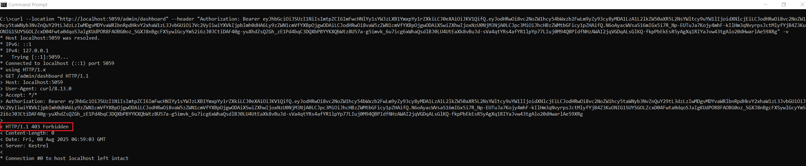

# Missing Function Level Access Control
Part of the [AppSec Labs Project](https://github.com/paulburkinshaw/appsec-labs) – A collection of hands-on security vulnerability demonstrations.  

Missing function level access control occurs when an application fails to properly restrict access to certain functions based on user roles or permissions. In other words, users—whether logged in or not—can access functions or endpoints they should not be able to reach. This oversight can allow unauthorized users to perform privileged actions, access sensitive data, or even take control of critical parts of the application.

## Table of Contents
<details>
<summary>Show</summary>

- [Missing Function Level Access Control](#missing-function-level-access-control)
  - [Table of Contents](#table-of-contents)
  - [Quick Start](#quick-start)
  - [Lab Application](#lab-application)
    - [Application Flow](#application-flow)
  - [Security Requirements](#security-requirements)
  - [Insecure Version](#insecure-version)
    - [Vulnerability](#vulnerability)
    - [Exploiting Vulnerability](#exploiting-vulnerability)
    - [Summary](#summary)
  - [Secure Version](#secure-version)
    - [Testing Secure Version](#testing-secure-version)
    - [Summary](#summary-1)
  - [Mitigation Guidance](#mitigation-guidance)
    - [Do](#do)
    - [Do Not](#do-not)
  - [Running the Lab](#running-the-lab)
    - [Prerequisites](#prerequisites)
    - [Docker CLI](#docker-cli)
    - [Docker in Visual Studio](#docker-in-visual-studio)
    - [Visual Studio (without Docker)](#visual-studio-without-docker)
    - [.NET CLI](#net-cli)
      - [Windows](#windows)
      - [Linux/macOS](#linuxmacos)
  - [Disclaimer](#disclaimer)
  - [References](#references)
    - [Further Reading](#further-reading)

</details>

## Quick Start
Run the insecure version of this lab locally using Docker:

```bash
git clone https://github.com/paulburkinshaw/appsec-labs.git
cd appsec-labs/owasp-top-10-2021/a01-broken-access-control/missing-function-level-access-control  

./compose-up-insecure.sh   # Linux/macOS
# or
compose-up-insecure.bat    # Windows
```
- App will be available at: **http://localhost:5082**
- A **login dropdown** selection will appear on load.

## Lab Application
The example app is made up of: 
- An ASP.NET Core Web API app with two endpoints: `user/dashboard` and `admin/dashboard`.
- An ASP.NET Core Web App that displays a Login page with a simple dropdown selection with login button that allows selection between a basic user and an admin user[[1]](#references).  Once authenticated, a dashboard page is displayed with data from either the `user/dashboard` endpoint, or `admin/dashboard` endpoint depending on which user was selected. 
  
### Application Flow
- Select a user from the login dropdown. 
- An access token is generated which contains either a `User` or `Admin` role claim. 
- The access token is used in a request to either `user/dashboard` or `admin/dashboard` depending on the role claim.
- The data in the response to `user/dashboard` or `admin/dashboard` is displayed on a dashboard page.
 
## Security Requirements
1. The `user/dashboard` can be accessed by any logged in user. 
2. The `admin/dashboard` should only be accessible to an admin user only.
3. Neither `user/dashboard` or `admin/dashboard` should be accessible to anonymous users.

## Insecure Version 
In the insecure version the two endpoints have been secured with a basic level of authorization -  only authenticated users are allowed to execute the endpoints. This has been implemented by decorating the controller actions with the `Authorize` attribute: 

```C#
 [Authorize]
 [HttpGet("/admin/dashboard")]
 public Dashboard GetAdminDashboard()
 {
     return new Dashboard
     {
         WorkItems = [
         "Admin Work Item 1",
         "Admin Work Item 2",
         "Admin Work Item 3"
         ]
     };
 }

 [Authorize]
 [HttpGet("/user/dashboard")]
 public Dashboard Get()
 {
     return new Dashboard
     {
         WorkItems = [
         "Work Item 1",
         "Work Item 2",
         "Work Item 3"
         ]
     };
 }
```

### Vulnerability
With the `[Authorize]` attribute applied, if an anonymous user makes a request to `user/dashboard` or `admin/dashboard`, a `401 Unauthorized` response will be returned. However, although the Insecure.Web app does not directly allow a basic user to view the admin dashboard, there is nothing stopping them from calling the admin/dashboard endpoint directly.
This can be done by simply making a **GET** request to the endpoint via cURL, or using an API testing tool like Postman.

### Exploiting Vulnerability
The following steps demonstrate how an unauthorized user can access admin functionality, violating the app’s security requirements.

1. Ensure all the individual apps are running (see the [Running the Lab](#running-the-lab) section below)
2. Open a browser and navigate to `http://localhost:5082`
3. Select User 1 from the dropdown and click the Login button.
    <details>
    <summary>Show screenshot</summary>
    
    </details>
4. Copy the query string value from the browser address bar (everything after `http://localhost:5082/?jwt=`).
    <details>
    <summary>Show screenshot</summary>
    
    </details>
5. Open a command window and execute: `curl --location "http://localhost:5059/user/dashboard" --header "Authorization: Bearer [jwt]"` replacing `[jwt]` with the token you copied above.  
You should receive the dashboard items for a basic user — the same data shown when logging into the web app.
    <details>
    <summary>Show screenshot</summary>
    
    </details>
6. Run the cURL command again with the same jwt but update the URL to the `admin/dashboard` endpoint: `curl --location "http://localhost:5059/admin/dashboard" --header "Authorization: Bearer [jwt]"`. You should now get the dashboard items for the admin user which is obviously not desirable and violates the [2nd Security requirement](#security-requirements): **The `admin/dashboard` endpoint should only be accessible to an admin user.**
    <details>
    <summary>Show screenshot</summary>
    
    </details>

### Summary
In this insecure version, the JWT is exposed in the query string and passed directly to the API. Because the API only checks for a valid token and whether a user is authenticated and does not enforce any further authorization, any logged in user can access admin functionality.
The next section demonstrates the secure version, where claims-based authorization prevents this escalation.

>Note  
>In this insecure version, the JWT is exposed in the query string, in practice, tokens should never be passed via query strings — this is simplified for demonstration purposes.  

---

## Secure Version
In the secure version of the app Claims-based authorization[[2]](#references) has been used to protect the `admin/dashboard` endpoint from being accessed by any user that doesn't have the `Admin` role claim. This has been implemented by applying the `IsAdmin` policy to the `GetAdminDashboard` action using the `Authorize` attribute.
```C#
 [Authorize(Policy = "IsAdmin")]
 [HttpGet("/admin/dashboard")]
 public Dashboard GetAdminDashboard()
 {
     return new Dashboard
     {
         WorkItems = [
         "Admin Work Item 1",
         "Admin Work Item 2",
         "Admin Work Item 3"
         ]
     };
 }
```

The policy has been configured in Program.cs as part of the call to `AddAuthorization()` in ConfigureServices.

```C#
builder.Services.AddAuthorization(options =>
{
    options.AddPolicy("IsAdmin", policyBuilder
        => policyBuilder.RequireClaim(ClaimTypes.Role, "Admin"));
});
```
This policy is used by the AuthorizationMiddleware to determine whether the user is allowed to execute the endpoint.
If the user is not authenticated, a **401 Unauthorized** response will be returned. If the user is authenticated but doesn't have the required claims, a **403 Forbidden** response will be returned.

### Testing Secure Version
We’ll now repeat the same steps used in [exploiting the insecure version](#exploiting-vulnerability) to confirm the changes satisfy the [Security Requirements](#security-requirements):

1. Ensure all the individual apps are running (see the [Running the Lab](#running-the-lab) section below)
2. Open a browser and navigate to `http://localhost:5082`
3. Select User 1 from the dropdown and click the Login button.
    <details>
    <summary>Show screenshot</summary>
    
    </details>
4. Open a command window and execute: `curl --location "http://localhost:5059/user/dashboard" --header "Authorization: Bearer [jwt]"` replacing `[jwt]` with the token you received during login.  
You should receive the dashboard items for a basic user — the same data shown when logging into the web app.
    <details>
    <summary>Show screenshot</summary>
    
    </details>
6. Run the cURL command again with the same jwt but update the URL to the `admin/dashboard` endpoint: `curl --location "http://localhost:5059/admin/dashboard" --header "Authorization: Bearer [jwt]" -v`.  
You should receive a 403 Forbidden response — this is expected and confirms the fix satisfies the [2nd Security requirement](#security-requirements):  
**The `admin/dashboard` endpoint should only be accessible to an admin user.**. 
    <details>
    <summary>Show screenshot</summary>
    
    </details>

### Summary
In this secure version, the JWT is no longer passed in the query string and instead is stored securely in the session. The API now enforces **claims-based authorization**, which ensures that only users with the correct role can access admin functionality.  

As a result:  
- Normal users attempting to access `/admin/dashboard` receive a **403 Forbidden** response.  
- Admin users can still access their dashboard as expected.  

> Note  
> For simplicity in this lab, JWTs are not signed or validated. This means they could still be forged (e.g., creating a token with an `Admin` role). This weakness is **intentional** — the goal here is to highlight *Broken Access Control*. Signature validation will be introduced in a later lab.  

---

## Mitigation Guidance

### Do
- **Enforce role- or permission-based checks on every sensitive endpoint** — use `[Authorize(Policy = "...")]` or equivalent.
- **Apply authorization at the server side**, never just in the client UI or routing logic.
- **Deny by default** — configure policies so that endpoints require explicit access rules.
- **Validate tokens and claims on every request**, not just at login.
- **Log and monitor access attempts** — especially failed or unauthorized requests.
- **Test access controls** — include automated security tests for both positive and negative access cases.
- **Follow the Principle of Least Privilege** — give accounts only the permissions they need.
  
### Do Not
- **Rely solely on authentication** — logging in does not mean a user can do everything.
- **Assume the client enforces security** — users can bypass UI and call APIs directly.
- **Expose admin or privileged endpoints without role checks**.
- **Return the same HTTP status for all failures** when it obscures security — differentiate `401 Unauthorized` and `403 Forbidden`.
- **Hardcode secrets or keys in code** — use secure storage such as Azure Key Vault or AWS KMS.
- **Skip verifying JWT claims** — simply having a token does not guarantee proper role/permission.
- **Forget to test for insecure direct access** — attackers will.

---

## Running the Lab
>Note: This lab is designed to run entirely on local machines. No internet access is required for its functionality once dependencies are installed.

### Prerequisites
- [.NET 8 SDK](https://dotnet.microsoft.com/en-us/download) or later
- [Docker Desktop](https://www.docker.com/products/docker-desktop/) installed and running
- Visual Studio 2022+ (with Docker and ASP.NET Core workloads) — for Visual Studio scenarios

### Docker CLI
- Ensure you have [Docker Desktop](https://www.docker.com/products/docker-desktop/) installed and running.
- Open a terminal (Command Prompt on Windows or a shell on Linux/macOS) in [this](./) folder  
- Run `compose-up-insecure.bat` or `compose-up-secure.bat` on Windows  
- or `./compose-up-insecure.sh` or `./compose-up-secure.sh` on Linux/macOS
- Open a browser window and enter `http://localhost:5082` in the address bar.
- You should see a login dropdown selection. 

>This is the quickest way to get the app up and running, however if you would like to debug the app and step through the code see 
>- [Docker in Visual Studio](#docker-in-visual-studio) if you'd like to debug **and** run the apps in containers.
>- [Visual Studio](#visual-studio) if you'd just like to debug on your local host.

### Docker in Visual Studio
- Ensure you have [Docker Desktop](https://www.docker.com/products/docker-desktop/) installed and running.
- First start the Insecure/Secure API and Web apps in containers by opening Visual Studio and clicking File/Open/Project/Solution and select either **Insecure.sln** or **Secure.sln** located in [/insecure/backend/](./insecure/backend/) or [/secure/backend/](./secure/backend/) depending on which version of the app you'd like to run.
- Ensure the docker-compose project is set as the startup project as above and press F5 to start up containers for the web api and web app projects in debugging mode (or click the green debug button).
- You should see a login dropdown selection. 

### Visual Studio (without Docker)
- First start the Insecure/Secure API and Web apps by Visual Studio and clicking File/Open/Project/Solution and select either **Insecure.sln** or **Secure.sln** located in [/insecure/backend/](./insecure/backend/) or [/secure/backend/](./secure/backend/) depending on which version of the app you'd like to run.
- With the solution open in Visual Studio, right click on the Solution node in Solution Explorer and select **Configure Startup Projects**
- Click on Multiple startup projects.
- Select Start from the Action dropdown for the two projects and click Apply.
- Click Yes when prompted to save the changes.
- Press F5 to start running both projects in debugging mode (or click the green run button).
- Open a browser window and enter `http://localhost:5082` in the address bar.
- You should see a login dropdown selection. 

### .NET CLI
You can run the applications using the .NET CLI without an IDE or Docker:

#### Windows
Open a Command Prompt or Powershell window in [this](./) folder  
Then run either: 
```cmd
dotnet-run-insecure.bat
```
or 
```
dotnet-run-secure.bat
```

#### Linux/macOS
Open a terminal in [this](./) folder    
Then run either:
```bash
./dotnet-run-insecure.sh
```
 or 
 ```bash
 ./dotnet-run-secure.sh
 ```  
 Make sure the .sh files are executable:  
 ```bash
chmod +x dotnet-run-insecure.sh dotnet-run-secure.sh
 ```
 
Each app will be launched in its own terminal window (or background process), allowing you to observe each service independently.

## Disclaimer  
>This application is for demonstration and educational purposes only.    
>Do not use these patterns as-is in production.

## References
[1]: Login functionality has been implemented as a simple dropdown selection with login button with two users (a basic user and an admin user) hard coded in the web app. It has been implemented this way in order to show how the app functions when logging in as different users without needing a complete identity provider solution.

[2]: Claims-based authorization uses the current user’s claims to determine access rights. Policies define which claims are required to execute specific actions. Claims-based authorization enforces access control at the function level, not just authentication. This ensures that only users with the correct role or permission can access sensitive endpoints, reducing the risk of privilege escalation. This approach aligns with [OWASP ASVS](https://owasp.org/www-project-application-security-verification-standard/) controls for access control and key management

### Further Reading
- [OWASP Top 10 - Broken Access Control](https://owasp.org/Top10/A01_2021-Broken_Access_Control/)
- [OWASP DotNet Security Cheat Sheet - Missing Function Level Access Control](https://cheatsheetseries.owasp.org/cheatsheets/DotNet_Security_Cheat_Sheet.html#missing-function-level-access-control)
