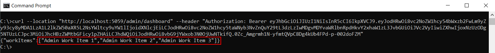

# Missing Function Level Access Control
Missing function level access control occurs when an application fails to properly restrict access to certain functions based on user roles or permissions. In other words, users—whether logged in or not—can access functions or endpoints they should not be able to reach. This oversight can allow unauthorized users to perform privileged actions, access sensitive data, or even take control of critical parts of the application.

## Example App Description
The example app is made up of: 
- **Insecure.API** - an ASP.NET Core Web API app with two endoints: `user/dashboard` and `admin/dashboard`.
- **Insecure.Web** - an ASP.NET Core Web App that displays data returned from the above endpoints on a Dashboard page for logged in users*  
- **Authentication.API** - an ASP.NET Core Web API app with a `/login` endpoint that accepts a username (either `user1` or `admin1`) and  returns an access token containing a role claim (either `User` or `Admin` depending on the user). The access token is then used by the Insecure.Web app to call the Insecure.API endpoints.

**Login functionality has been implemented as a simple drop down selection with login button with a basic user and an admin user hard coded in the Authentication.API app in order to simulate how the app functions when logging in as a basic user and an admin user.*

## Security Requirements
- The `user/dashboard` can be accessed by any logged in user. 
- The `admin/dashboard` should only be accessible to an admin user only.
- Neither `user/dashboard` or `admin/dashboard` should be accessible to anonymous users.

## Insecure Version 
In the insecure version the two endpoints have been secured with a basic level of authorization -  only authenticated users are allowed to execute the endpoints. This has been implemented by decorating the controller actions with with the `Authorize` attribute: 

```C#
 [Authorize]
 [HttpGet("/admin/dashboard")]
 public Dashboard GetAdminDashboard()
 {
     return new Dashboard
     {
         WorkItems = [
         "Admin Work Item 1",
         "Admin Work Item 2",
         "Admin Work Item 3"
         ]
     };
 }

 [Authorize]
 [HttpGet("/user/dashboard")]
 public Dashboard Get()
 {
     return new Dashboard
     {
         WorkItems = [
         "Work Item 1",
         "Work Item 2",
         "Work Item 3"
         ]
     };
 }
```

### Vulnerability
With the `[Authorize]` attribute applied, if an anonymous user makes a request to `user/dashboard` or `admin/dashboard`, a `401 Unauthorized` response will be returned. However, although the Insecure.Web app does not directly allow a basic user to view the admin dashboard, there is nothing stopping a user logged in as a basic user calling the `admin/dashboard` endpoint directly.

*which can be done with a simple Curl request, or simply making a Get request to the endpoint via Curl or a using an API testing tool like Postman
No `[Authorize(Roles = "Admin")]` check — and that's the vulnerability*

### Exploitating Vulnerability
1. Ensure all the apps are running:
   - Execute `dotnet run` in a command window in the [**Authentication.API** project folder](../../../shared/appsec-labs-idp/Authentication.API/), [**Insecure.API** app](./insecure/backend/src/Insecure.API/) and [**Insecure.WEB** app](./insecure/backend/src/Insecure.Web/) project folders or run the apps in Visual Studio (click the green run button for each project).
2. Open a browser and navigate to `http://localhost:5082`
3. Select User 1 from the drop down and click the Login button.
    <details>
    <summary>Show screenshot</summary>
    
    </details>
4. Copy the query string value from the browser address bar (everything after `http://localhost:5082/Dashboard?jwt=`).
    <details>
    <summary>Show screenshot</summary>
    
    </details>
5. Open a command window and execute: `curl --location "http://localhost:5059/user/dashboard" --header "Authorization: Bearer [jwt]"` replacing `[jwt]` with the token you copied from the address bar in step 4. You should get the dashboard items for a basic user as you did when logging in to the Insecure.WEB app.
    <details>
    <summary>Show screenshot</summary>
    
    </details>
6. Execute the Curl command again with the same jwt but this time update the URL to point to the `admin/dashboard` endpoint: `curl --location "http://localhost:5059/admin/dashboard" --header "Authorization: Bearer [jwt]"`. You should now get the dashboard items for the admin user.
    <details>
    <summary>Show screenshot</summary>
    
    </details>

## Secure Version
In the secure version 

### Remediation

As with all filters, you can apply the [Authorize] attribute at the controller level to protect all the actions on a controller, to a Razor Page to protect all the page handler
methods in a page, or even globally to protect every endpoint in your app.


## References
- [OWASP Top 10 link](https://owasp.org/Top10/A01_2021-Broken_Access_Control/)
- External links for further reading
