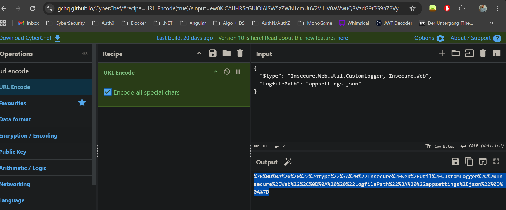
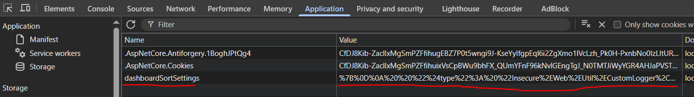

# Insecure Deserialization
Part of the [AppSec Labs Project](https://github.com/paulburkinshaw/appsec-labs) – A collection of hands-on security vulnerability demonstrations.  

**Serialization** is the process of converting an object into a data format such as a stream of bytes to store the object in a database, a file, or to send as part of communications.  
**Deserialization** is the reverse of that process, taking data structured in some format, and rebuilding it into an object.  

Serialization and deserialization are commonly used in web applications to store and transmit complex data structures and while useful for this purpose, they can also introduce security risks if not properly implemented. For example, serialized data can be tampered with or manipulated by an attacker to inject malicious code, if the serialized data is not properly validated when the data is reconstructed during deserialization, the behavior of the application can be altered or worse which can lead to disatrous consequences such as attackers achieving remote code execution, escalating privileges, or launching denial-of-service attacks. This situation, when an application trusts serialized data enough to use it without validating its authenticity is called **insecure deserialization**.

This type of vulnerability is prevalent in applications that serialize and deserialize complex data structures across various programming environments, such as Java, .NET, and PHP, which often use serialization for remote procedure calls, session management, and more.  
In this lab we will look at how .Net applications can be vulnerable to insecure deserialization attacks and how to mitigate these risks.

>Note: in general terms, the intent of serialization is to transmit an object into or out of an app. A threat modeling exercise almost always marks this kind of data transfer as crossing a trust boundary. [1](#references)

## Table of Contents
<details>
<summary>Show</summary>

- [Insecure Deserialization](#insecure-deserialization)
  - [Table of Contents](#table-of-contents)
  - [Quick Start](#quick-start)
  - [Lab Application](#lab-application)
    - [Application Flow](#application-flow)
  - [Security Requirements](#security-requirements)
  - [Insecure Version](#insecure-version)
    - [Vulnerability](#vulnerability)
    - [Exploiting Vulnerability](#exploiting-vulnerability)
  - [Secure Version](#secure-version)
  - [Do / Do Not](#do--do-not)
    - [Do](#do)
    - [Do Not](#do-not)
  - [Do / Do Not for Json.Net](#do--do-not-for-jsonnet)
    - [Do](#do-1)
    - [Do Not](#do-not-1)
  - [Running the Lab](#running-the-lab)
    - [Prerequisites](#prerequisites)
    - [Docker CLI](#docker-cli)
    - [Docker in Visual Studio](#docker-in-visual-studio)
    - [Visual Studio (without Docker)](#visual-studio-without-docker)
    - [.NET CLI](#net-cli)
      - [Windows](#windows)
      - [Linux/macOS](#linuxmacos)
  - [Further Enhancements](#further-enhancements)
  - [Disclaimer](#disclaimer)
  - [References](#references)
    - [Links](#links)

</details>

## Quick Start
Run the insecure version of this lab locally using Docker:

```bash
git clone https://github.com/paulburkinshaw/appsec-labs.git
cd appsec-labs/owasp-top-10-2021/a08-software-and-data-integrity-failures/insecure-deserialization

./compose-up-insecure.sh   # Linux/macOS
# or
compose-up-insecure.bat    # Windows
```
- App will be available at: **http://localhost:5082**

## Lab Application
The example app is made up of: 
- An ASP.NET Core Web API app with a `user/dashboard` endpoint.
- An ASP.NET Core Web App that displays a login page with a simple user dropdown selection with login button used to simulate login functionality [1](#references). 
- Once authenticated, a dashboard page is displayed with data from the `user/dashboard` endpoint.
- The dashboard page includes a list of work items for the user and a sorting and filtering feature that uses serialized data stored in a `dashboardSortSettings` cookie to maintain state across requests.

### Application Flow
- Select user from the login dropdown. 
- An access token is generated for the user and sent in a request to the `user/dashboard` endpoint.
- The work items in the response to `user/dashboard` are displayed on a dashboard page.
- Sorting can be done using the controls on the dashboard page, which utilize the `dashboardSortSettings` cookie to maintain the user's preferences.

## Security Requirements
1. The application must ensure that serialized data used for sorting and filtering on the dashboard page is secure and cannot be tampered with by an attacker.
2. The application must validate and sanitize all user input before using it in any serialized data.
3. The application must implement integrity checks or validate digital signatures on serialized objects received from the network.

---

## Insecure Version 
In the insecure version of the app, the `dashboardSortSettings` cookie is created using Json.Net `JsonConvert` class to serialize an object containing the user's sorting and filtering preferences. The serialized data is then stored in the cookie without any validation or integrity checks. This allows an attacker to modify the serialized data in the cookie and potentially execute arbitrary code when the data is deserialized on the server side.

### Vulnerability
The application deserializes untrusted data directly from a client-supplied cookie:

```C#
var cookieValue = Request.Cookies["dashboardSortSettings"];
if (!string.IsNullOrEmpty(cookieValue))
{
    try
    {
        dashboardSortSettings = JsonConvert.DeserializeObject<DashboardSortSettings>(cookieValue, JsonSerializerSettings);
        if (dashboardSortSettings == null)
            throw new Exception($"unable to deserialize cookie value: {cookieValue}");

        ViewModel.DashboardSortSettings = dashboardSortSettings;
    }
    catch (JsonSerializationException ex)
    {
        // Oops: developer tries to help debug by including full deserialized object in error
        var deserializedObj = JsonConvert.DeserializeObject(cookieValue, JsonSerializerSettings);
        throw new JsonSerializationException(
            $"Dashboard settings type mismatch. Full object: {JsonConvert.SerializeObject(deserializedObj)}",
            ex
        );
    }
}
```
Key issue:

- The app uses `TypeNameHandling.All` (in `JsonSerializerSettings`), which allows polymorphic deserialization.
- An attacker can provide a different type (not `DashboardSortSettings`) that still exists in the application’s codebase.
- In this lab, we abuse the forgotten `CustomLogger` class.
- The `CustomLogger` class is not properly secured and can be exploited by an attacker to execute arbitrary code.
- The attacker can craft a malicious payload that, when deserialized, calls methods on the CustomLogger class with attacker-controlled arguments.

This allows an attacker to modify the serialized data in the cookie and potentially execute arbitrary code when the data is deserialized on the server side.

### Exploiting Vulnerability
An attacker can exploit this vulnerability by crafting a malicious payload that can replace the existing serialized data in the `dashboardSortSettings` cookie. For example, the attacker can create a payload that, when deserialized, calls the `LogFilePath` setter on the `CustomLogger` class with an attacker-controlled file path such as `appsettings.json` which exists in the application root folder. The attacker can then view the contents of the file in the error message returned by the application which includes the full deserialized object in the error message.

```C#
catch (JsonSerializationException ex)
{
    // Oops: developer tries to help debug by including full deserialized object in error
    var deserializedObj = JsonConvert.DeserializeObject(cookieValue, JsonSerializerSettings);
    throw new JsonSerializationException(
        $"Dashboard settings type mismatch. Full object: {JsonConvert.SerializeObject(deserializedObj)}",
        ex
    );
}
```


As can be seen in the error message above, the contents of the `appsettings.json` file are displayed, which in this case contains a piece of sensitive information - a database connection string. 

The steps to carry out the above are: 
- Craft a malicious payload that replaces the existing serialized data in the `dashboardSortSettings` cookie.
   ```json
   {
    "$type": "Insecure.Web.Util.CustomLogger, Insecure.Web",
    "LogfilePath": "appsettings.json"
   }
   ```
- Use Cyber Chef to URL Encode the above payload.
  
- Replace the existing serialized data in the `dashboardSortSettings` cookie with the crafted payload.
   
- Trigger the deserialization process on the server-side by refreshing the dashboard page.
- View the contents of the `appsettings.json` file in the error message returned by the application.

---

## Secure Version
Coming soon.

---

## Do / Do Not
[https://cheatsheetseries.owasp.org/cheatsheets/DotNet_Security_Cheat_Sheet.html#a08-software-and-data-integrity-failures](https://cheatsheetseries.owasp.org/cheatsheets/DotNet_Security_Cheat_Sheet.html#a08-software-and-data-integrity-failures) 

### Do
- DO: Validate all incoming data before deserialization.
- DO: Use strong encryption to protect serialized data both in transit and at rest.
- DO: Digitally sign assemblies and executable files
- DO: Use Nuget package signing
- DO: Review code and configuration changes to avoid malicious code or dependencies being introduced
- DO: Perform integrity checks or validate digital signatures on serialized objects received from the network

### Do Not
- DO NOT: Deserialize untrusted data.
- DO NOT: Allow users to control the types being deserialized.
- DO NOT: Use user-controlled data to define the expected type.
- DO NOT: Use deserialization methods that allow automatic type resolution
- DO NOT: Deserialize data from untrusted sources without proper validation and integrity checks
- DO NOT: Use insecure or outdated serialization formats
- DO NOT: Send sensitive data in serialized objects without encryption
- DO NOT: Send unsigned or unencrypted serialized objects over the network
- DO NOT: Use the BinaryFormatter type which is dangerous and not recommended for data processing. .NET offers several in-box serializers that can handle untrusted data safely:
  - XmlSerializer and DataContractSerializer to serialize object graphs into and from XML. Do not confuse DataContractSerializer with NetDataContractSerializer.
  - BinaryReader and BinaryWriter for XML and JSON.
  - The System.Text.Json APIs to serialize object graphs into JSON.
- DO NOT: Roll your own serialization format. Use a well-known, well-tested library instead.

## Do / Do Not for Json.Net
Everything in the above list applies to Json.Net as well, plus the following:
### Do
- DO: Use a custom `SerializationBinder` to whitelist deserialization Types if `TypeNameHandling` is required.
- DO: Use `JsonSerializerSettings` to configure deserialization options securely. 
  
### Do Not
- DO NOT: Use `TypeNameHandling.All` or `TypeNameHandling.Auto` without a custom `SerializationBinder`.

---

## Running the Lab
>Note: This lab is designed to run entirely on local machines. No internet access is required for its functionality once dependencies are installed.

### Prerequisites
- [.NET 8 SDK](https://dotnet.microsoft.com/en-us/download) or later
- [Docker Desktop](https://www.docker.com/products/docker-desktop/) installed and running
- Visual Studio 2022+ (with Docker and ASP.NET Core workloads) — for Visual Studio scenarios

### Docker CLI
- Ensure you have [Docker Desktop](https://www.docker.com/products/docker-desktop/) installed and running.
- Open a terminal (Command Prompt on Windows or a shell on Linux/macOS) in [this](./) folder  
- Run `compose-up-insecure.bat` or `compose-up-secure.bat` on Windows  
- or `./compose-up-insecure.sh` or `./compose-up-secure.sh` on Linux/macOS
- Open a browser window and enter `http://localhost:5082` in the address bar.
- You should see a login dropdown selection. 

>This is the quickest way to get the app up and running, however if you would like to debug the app and step through the code see 
>- [Docker in Visual Studio](#docker-in-visual-studio) if you'd like to debug **and** run the apps in containers.
>- [Visual Studio](#visual-studio) if you'd just like to debug on your local host.

### Docker in Visual Studio
- Ensure you have [Docker Desktop](https://www.docker.com/products/docker-desktop/) installed and running.
- First start the **Authentication.API** app in a container by opening an instance of Visual Studio and clicking File/Open/Project/Solution and select the **Appsec-Labs-IDP.sln** located in the [**Authentication.API**](../../../shared/appsec-labs-idp/Authentication.API/) project folder.
- Ensure the docker-compose project is selected as the startup project (you’ll see it in bold in Solution Explorer). If not, right click on it and select Set as Startup Project.
- Press F5 to start up a container for the Authentication.API project in debugging mode (or click the green debug button).
- Next start the Insecure/Secure API and Web apps in containers by opening another instance of Visual Studio and clicking File/Open/Project/Solution and select either **Insecure.sln** or **Secure.sln** located in [/insecure/backend/](./insecure/backend/) or [/secure/backend/](./secure/backend/) depending on which version of the app you'd like to run.
- Ensure the docker-compose project is set as the startup project as above and press F5 to start up containers for the web api and web app projects in debugging mode (or click the green debug button). 

### Visual Studio (without Docker)
- First start the **Authentication.API** app by opening an instance of Visual Studio and clicking File/Open/Project/Solution and select the **Appsec-Labs-IDP.sln** located in the [**Authentication.API**](../../../shared/appsec-labs-idp/Authentication.API/) project folder.
- Press F5 to start the Authentication.API project in debugging mode (or click the green debug button).
- Next start the Insecure/Secure API and Web apps by opening another instance of Visual Studio and clicking File/Open/Project/Solution and select either **Insecure.sln** or **Secure.sln** located in [/insecure/backend/](./insecure/backend/) or [/secure/backend/](./secure/backend/) depending on which version of the app you'd like to run.
- With the solution open in Visual Studio, right click on the Solution node in Solution Explorer and select **Configure Startup Projects**
- Click on Multiple startup projects.
- Select Start from the Action dropdown for the two projects and click Apply.
- Click Yes when prompted to save the changes.
- Press F5 to start running both projects in debugging mode (or click the green run button).
- Open a browser window and enter `http://localhost:5082` in the address bar.
- You should see a login dropdown selection. 

### .NET CLI
You can run the applications using the .NET CLI without an IDE or Docker:

#### Windows
Open a Command Prompt or Powershell window in [this](./) folder  
Then run either: 
```cmd
dotnet-run-insecure.bat
```
or 
```
dotnet-run-secure.bat
```

#### Linux/macOS
Open a terminal in [this](./) folder    
Then run either:
```bash
./dotnet-run-insecure.sh
```
 or 
 ```bash
 ./dotnet-run-secure.sh
 ```  
 Make sure the .sh files are executable:  
 ```bash
chmod +x dotnet-run-insecure.sh dotnet-run-secure.sh
 ```
 
Each app will be launched in its own terminal window (or background process), allowing you to observe each service independently.

## Further Enhancements
- Avoid insecure serialisation formats: Avoid using inherently insecure serialisation formats like Java serialisation. Choose safer alternatives such as JSON or XML with robust validation mechanisms.
- Avoid eval and exec: Avoid using eval() and exec() functions, as they can execute arbitrary code and pose a significant security risk.
- Input validation and output encoding: Implement stringent input validation to ensure that only expected data is accepted. Apply output encoding techniques to sanitise data before serialisation.
- Secure coding practices: Follow secure coding practices recommended by security standards and guidelines. Adopt principles such as least privilege, defence in depth, and fail-safe defaults.
- Adherence to guidelines: Established secure coding guidelines specific to the programming language or framework

## Disclaimer  
>This application is for demonstration and educational purposes only.    
>Do not use these patterns as-is in production.

## References
[1]: Login functionality has been implemented as a simple dropdown selection with login button a user hard coded in the web app. It has been implemented this way for simplicity in order to show the core topics of the lab without introducing a full authentication mechanism.

[2]:  https://learn.microsoft.com/en-us/dotnet/standard/serialization/binaryformatter-security-guide

### Links
- [OWASP Top 10 link](https://owasp.org/Top10/A08_2021-Software_and_Data_Integrity_Failures/)
- External links for further reading
