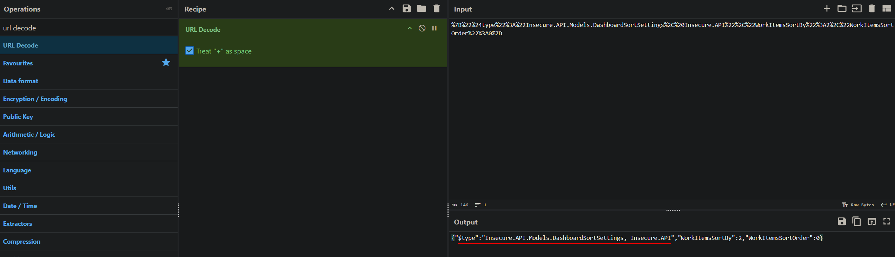

# Insecure Deserialization
Part of the [AppSec Labs Project](https://github.com/paulburkinshaw/appsec-labs) – A collection of hands-on security vulnerability demonstrations.  

**Serialization** is the process of converting an object into a data format such as a stream of bytes to store the object in a database, a file, or to send as part of communications.  
**Deserialization** is the reverse of that process, taking data structured in some format, and rebuilding it into an object.  

Serialization and deserialization are commonly used in web applications to store and transmit complex data structures and while useful for this purpose, they can also introduce security risks if not properly implemented. For example, serialized data can be tampered with or manipulated by an attacker to inject malicious code, if the serialized data is not properly validated when the data is reconstructed during deserialization, the behavior of the application can be altered or worse which can lead to disatrous consequences such as attackers achieving remote code execution, escalating privileges, or launching denial-of-service attacks. This situation, when an application trusts serialized data enough to use it without validating its authenticity is called **insecure deserialization**.

This type of vulnerability is prevalent in applications that serialize and deserialize complex data structures across various programming environments, such as Java, .NET, and PHP, which often use serialization for remote procedure calls, session management, and more.  
In this lab we will look at how .Net applications can be vulnerable to insecure deserialization attacks and how to mitigate these risks.

>Note: in general terms, the intent of serialization is to transmit an object into or out of an app. A threat modeling exercise almost always marks this kind of data transfer as crossing a trust boundary. [1](#references)

## Table of Contents
<details>
<summary>Show</summary>

- [Insecure Deserialization](#insecure-deserialization)
  - [Table of Contents](#table-of-contents)
  - [Quick Start](#quick-start)
  - [Lab Application](#lab-application)
    - [Application Flow](#application-flow)
  - [Security Requirements](#security-requirements)
  - [Insecure Version](#insecure-version)
    - [Vulnerability](#vulnerability)
      - [Key issues](#key-issues)
    - [Exploiting Vulnerability](#exploiting-vulnerability)
      - [Exploitation Steps](#exploitation-steps)
    - [Summary](#summary)
    - [Impact](#impact)
  - [Secure Version](#secure-version)
    - [Mitigations](#mitigations)
      - [1. Secured Json.Net Settings](#1-secured-jsonnet-settings)
      - [2. Digital Signatures](#2-digital-signatures)
      - [3. Cookie Security Flags](#3-cookie-security-flags)
        - [HttpOnly Flag](#httponly-flag)
        - [SameSite Flag](#samesite-flag)
        - [Secure Flag](#secure-flag)
      - [4. Input validation](#4-input-validation)
      - [A note about CustomLogger](#a-note-about-customlogger)
    - [Testing Secure Version](#testing-secure-version)
    - [Summary](#summary-1)
  - [Mitigation Guidance](#mitigation-guidance)
    - [Do](#do)
    - [Do Not](#do-not)
    - [Mitigation Guidance for Json.Net](#mitigation-guidance-for-jsonnet)
      - [Do](#do-1)
      - [Do Not](#do-not-1)
  - [Running the Lab](#running-the-lab)
    - [Prerequisites](#prerequisites)
    - [Docker CLI](#docker-cli)
    - [Docker in Visual Studio](#docker-in-visual-studio)
    - [Visual Studio (without Docker)](#visual-studio-without-docker)
    - [.NET CLI](#net-cli)
      - [Windows](#windows)
      - [Linux/macOS](#linuxmacos)
  - [Further Enhancements](#further-enhancements)
  - [Disclaimer](#disclaimer)
  - [References](#references)
    - [Links](#links)

</details>

## Quick Start
Run the insecure version of this lab locally using Docker:

```bash
git clone https://github.com/paulburkinshaw/appsec-labs.git
cd appsec-labs/owasp-top-10-2021/a08-software-and-data-integrity-failures/insecure-deserialization

./compose-up-insecure.sh   # Linux/macOS
# or
compose-up-insecure.bat    # Windows
```
- App will be available at: **http://localhost:5082**

## Lab Application
The example app is made up of: 
- An ASP.NET Core Web API app with a `user/dashboard` endpoint.
- An ASP.NET Core Web App that displays a login page with a simple user dropdown selection with login button used to simulate login functionality [1](#references). 
- Once authenticated, a dashboard page is displayed with data from the `user/dashboard` endpoint.
- The dashboard page includes a list of work items for the user and a sorting and filtering feature that uses serialized data stored in a `dashboardSortSettings` cookie to maintain state across requests.

### Application Flow
- Select user from the login dropdown. 
- An access token is generated for the user and sent in a request to the `user/dashboard` endpoint.
- The work items in the response to `user/dashboard` are displayed on a dashboard page.
- Sorting can be done using the controls on the dashboard page, which utilize the `dashboardSortSettings` cookie to maintain the user's preferences.

## Security Requirements
1. The application must ensure that serialized data used for sorting and filtering on the dashboard page is secure and cannot be tampered with by an attacker.
2. The application must validate and sanitize all user input before using it in any serialized data.
3. The application must implement integrity checks or validate digital signatures on serialized objects received from the network.

---

## Insecure Version 
In the insecure version of the app, the `dashboardSortSettings` cookie is created using Json.Net `JsonConvert` class to serialize an object containing the user's sorting and filtering preferences. The serialized data is then stored in the cookie without any validation or integrity checks. This allows an attacker to modify the serialized data in the cookie and potentially execute arbitrary code when the data is deserialized on the server side.

### Vulnerability
The application deserializes untrusted data directly from a client-supplied cookie:  


#### Key issues
- The app uses `TypeNameHandling.All` (in `JsonSerializerSettings`), which means the type information is included when serializing objects, making it easier for an attacker to craft a malicious payload.  
  <details>
      <summary>Show screenshot</summary>
      
  </details>
- The cookie data is not integrity-protected. An attacker can tamper with the `dashboardSortSettings` cookie and send back modified JSON (possibly exploiting the `TypeNameHandling.All`). 
- An attacker can provide a different types other than the expected `DashboardSortSettings` type.
- There is a seemingly innocuous `CustomLogger` class in the codebase that has a `LogfilePath` property with a setter that is used by the class to read and write log files to disk.
  <details>
      <summary>Show screenshot</summary>
      
  </details>
- The `CustomLogger` class is not properly secured and can be exploited by an attacker to gain access to the contents of the file specified in `LogfilePath`.

### Exploiting Vulnerability
An attacker can exploit this vulnerability by crafting a malicious payload that can replace the existing serialized data in the `dashboardSortSettings` cookie. For example, the attacker can create a payload that, when deserialized, calls the `LogFilePath` setter on the `CustomLogger` class with an attacker-controlled file path such as `appsettings.json` which exists in the application root folder. The attacker can then view the contents of the file in the error message returned by the application which includes the full deserialized object in the error message.

<details>
      <summary>Show screenshot</summary>
      
</details>

As can be seen in the error message above, the contents of the `appsettings.json` file are displayed, which in this case contains a piece of sensitive information - a database connection string. 

#### Exploitation Steps
The following steps demonstrate how an authenticated user can exploit the vulnerability and gain unauthorized access to sensitive information contained in the `appsettings.json` file, violating the app’s security requirements.

1. Ensure the insecure version of the app is running locally. See [Running the Lab](#running-the-lab) section for details.
2. Open a web browser and navigate to `http://localhost:5082`.
3. Select User 1 from the login dropdown and click the Login button to authenticate.
4. Set the sorting filters, any will do, and click the Apply Sort button.
5. Open the browser's developer tools (usually by pressing F12 or right-clicking and selecting "Inspect").
6. Go to the "Application" tab (in Chrome) or "Storage" tab (in Firefox).
7. Under "Storage" or "Cookies", find the cookie named `dashboardSortSettings`. This cookie contains the serialized state of the dashboard sorting settings.
   <details>
      <summary>Show screenshot</summary>
      
   </details>
8. Craft a malicious payload in `json` format that will be used to replace the existing cookie value.
   ```json
   {
    "$type": "Insecure.Web.Util.CustomLogger, Insecure.Web",
    "LogfilePath": "appsettings.json"
   }
   ```
9. URL encode the payload, there are many freely available tools you can use for this task, [Cyber Chef](https://gchq.github.io/CyberChef/#recipe=URL_Encode(true)) is one such tool.
    <details>
        <summary>Show screenshot</summary>
        
    </details>
10. Copy the value in the Output field replace the existing `dashboardSortSettings` cookie value with it.
    <details>
        <summary>Show screenshot</summary>
        
    </details>
11. Trigger the deserialization process on the server-side by refreshing the dashboard page. The deserialize attempt should fail with an error message, this is expected behaviour. However due to the error handling in the app which displays the full deserialized object in the error message, the contents of the `appsettings.json` file will be displayed in the error message.
    <details>
        <summary>Show screenshot</summary>
        
    </details>
12. Take note of the sensitive information revealed in the error message, such as the database connection string.
    <details>
        <summary>Show screenshot</summary>
        
    </details>

### Summary
In this lab, we demonstrated how insecure deserialization vulnerabilities can be exploited to gain access to sensitive information by manipulating serialized data stored in a client-side cookie. The application failed to validate and sanitize the serialized data before deserializing it, allowing an attacker to inject a malicious payload that exploited the `CustomLogger` class to read sensitive files on the server. 

>Note: The `CustomLogger` is an example of a gadget - a class that can be used in an attack due to its behavior during deserialization. This means that the class has certain methods or properties that can be leveraged by an attacker to achieve their goals. In this case, the `LogfilePath` property was used to specify the path of the file to be read and the `LogfileContents` property was used to read the contents of the file. For more information about known .NET RCE Gadgets see the OWASP Deserialization Cheat Sheet [here](https://cheatsheetseries.owasp.org/cheatsheets/Deserialization_Cheat_Sheet.html#known-net-rce-gadgets).

### Impact
Insecure deserialization vulnerabilities can lead to the following:

- Remote Code Execution: If an attacker can control the serialized object, they can execute arbitrary code on the server when deserialized.
- Denial-of-Service (DoS) Attacks: Deserialization is computationally expensive. Attackers can submit large, complex, serialized objects to exhaust server resources.
- Privilege Escalation: Depending on which object is being deserialized and how it’s used, an attacker could escalate their privileges if the deserialized object has more rights than the attacker.

---

## Secure Version
In the secure version of the app, several mitigations have been implemented to address the insecure deserialization vulnerability:

### Mitigations

#### 1. Secured Json.Net Settings
**Json.Net** settings have been secured by removing `TypeNameHandling.All` and using the default setting of `TypeNameHandling.None` which prevents type information from being included in the serialized data, and conversely ensures that only known types are deserialized.
  ```csharp
  JsonSerializerSettings settings = new JsonSerializerSettings
  {
      TypeNameHandling = TypeNameHandling.None
  };
  ```
#### 2. Digital Signatures
In order to prevent the cookie data from being tampered with, we have incorporated digital signatures into the application - the app now verifies the integrity and authenticity of the serialized data in the `dashboardSortSettings` cookie before deserializing it. If the signature is invalid, an exception is thrown and the deserialization process is not attempted.

These changes have been made in the `IndexModel` class where the `dashboardSortSettings` cookie is created and read.

Two new methods have been added:
```csharp
private string SignData(string data)
{
    // Create a content hash - a SHA-256 hash of the data being signed
    var contentHash = SHA256.HashData(Encoding.UTF8.GetBytes(data));

    // Compute a signature using HMAC with the secret key, the signature is unique to both the data and the key.
    using var hmacsha256 = new HMACSHA256(Encoding.UTF8.GetBytes(_secretKey));          
    var hash = hmacsha256.ComputeHash(contentHash);
    var signature = Convert.ToBase64String(hash);

    return signature;
}

private bool ValidateSignature(string data, string signature)
{         
    if (string.IsNullOrEmpty(data) || string.IsNullOrEmpty(data))
        return false;

    var expectedSignature = SignData(data);
    return expectedSignature == signature;
}
```
In the `SignData` method we first create a content hash of the data being signed using the `SHA256` algorithm.  
We then compute a signature using `HMAC` with the secret key which is declared as a private field in the class.
In the `VerifySignature` method we compare the provided signature with the expected signature generated from the data.

>Note: The secret key should be a sufficiently long and random value to ensure security. In a real application, store this securely (e.g., environment variable, secure vault). Also, consider using a key derivation function to generate a strong key from a passphrase. You would also typically want to rotate the secret key periodically and have a strategy for handling key rotation.

We use the `SignData` method to create a signature that is a hash of the serialized data and the secret key. The signature is then saved alongside the serialized data in the `dashboardSortSettings.sig` cookie.
```csharp
#region Sign Data
var serializedData = JsonConvert.SerializeObject(ViewModel.DashboardSortSettings, JsonSerializerSettings);
var signature = SignData(serializedData);
#endregion

#region Set Cookie                    
Response.Cookies.Append("dashboardSortSettings", serializedData, new CookieOptions { HttpOnly = true, Secure = true, SameSite = SameSiteMode.Strict });
Response.Cookies.Append("dashboardSortSettings.sig", signature, new CookieOptions { HttpOnly = true, Secure = true, SameSite = SameSiteMode.Strict });
#endregion
```

When getting the cookie value, we call the `ValidateSignature()` method passing the serialized data and the signature to validate before deserializing the data:
```csharp
if(!ValidateSignature(serializedData, signature))
    throw new Exception("Invalid cookie signature");
```

We then proceed to deserialize it as before:
```csharp
dashboardSortSettings = JsonConvert.DeserializeObject<DashboardSortSettings>(serializedData, JsonSerializerSettings);
```

#### 3. Cookie Security Flags
We have added the `HttpOnly`, `SameSite`, and `Secure` flags to the cookies to help mitigate the risk of client-side script accessing the cookies and to ensure they are only sent over HTTPS.

```csharp            
Response.Cookies.Append("dashboardSortSettings", serializedData, new CookieOptions { HttpOnly = true, Secure = true, SameSite = SameSiteMode.Strict });
Response.Cookies.Append("dashboardSortSettings.sig", signature, new CookieOptions { HttpOnly = true, Secure = true, SameSite = SameSiteMode.Strict });
```

##### HttpOnly Flag
The `HttpOnly` flag is used to prevent client-side scripts from accessing the cookie. This helps mitigate the risk of cross-site scripting (XSS) attacks, as even if an attacker is able to inject malicious scripts into the page, they will not be able to read the contents of the `HttpOnly` cookies.

##### SameSite Flag
The `SameSite` flag is used to control whether cookies are sent along with cross-site requests. By setting the `SameSite` attribute to `Strict` or `Lax`, we can help protect against cross-site request forgery (CSRF) attacks.

##### Secure Flag
The `Secure` flag is used to ensure that cookies are only sent over HTTPS connections. This helps protect the cookie from being intercepted by attackers during transmission.  
>Note: When running the app on localhost, the Secure flag does not require HTTPS — most browsers treat localhost as a secure context for development purposes. This is why your cookies still work over http://localhost. In production, however, the Secure flag will prevent cookies from being sent over plain HTTP, so always use HTTPS in live environments.

#### 4. Input validation
We have added input validation before serialization to ensure that only expected data is accepted and stored.

```csharp
if (ViewModel.DashboardSortSettings == null)
    throw new ArgumentNullException(nameof(ViewModel.DashboardSortSettings));

if (!Enum.IsDefined(typeof(WorkItemsSortBy), ViewModel.DashboardSortSettings.WorkItemsSortBy))
    throw new ArgumentException("Invalid sort by.");

if (!Enum.IsDefined(typeof(WorkItemsSortOrder), ViewModel.DashboardSortSettings.WorkItemsSortOrder))
    throw new ArgumentException("Invalid sort order.");
```
>Note: Even though the current secure version prevents tampering via digital signatures and Razor Page model binding, validating input before serialization/deserialization is still a defense-in-depth measure. This helps future-proof the application in case:
>
>- New data sources are introduced (e.g., APIs or external services).
>- Serialization logic changes or additional fields are added to the model.
>- Developers accidentally bypass existing protections.
>
>Validating enums, string lengths, and allowed values ensures that only safe, expected data is ever processed, reducing potential risk in future changes.

#### A note about CustomLogger
The `CustomLogger` class remains in the codebase for demonstration purposes. Even though this class could be exploited in an insecure scenario, the mitigations implemented in the secure version—such as type restrictions, digital signatures, cookie security flags, and input validation—prevent any abuse. In a real application, you should carefully evaluate whether such classes can be safely removed.

### Testing Secure Version
We’ll now repeat the same steps used in [exploiting the insecure version](#exploiting-vulnerability) to confirm the changes satisfy the [Security Requirements](#security-requirements):

1. Ensure the secure version of the app is running locally. See [Running the Lab](#running-the-lab) section for details.
2. Open a web browser and navigate to `http://localhost:5082`.
3. Select User 1 from the login dropdown and click the Login button to authenticate.
4. Set the sorting filters, any will do, and click the Apply Sort button.
5. Open the browser's developer tools (usually by pressing F12 or right-clicking and selecting "Inspect").
6. Go to the "Application" tab (in Chrome) or "Storage" tab (in Firefox).
7. Under "Storage" or "Cookies", find the cookie named `dashboardSortSettings`. As in the insecure version, this cookie contains the serialized state of the dashboard sorting settings. There should also be a cookie named `dashboardSortSettings.sig`. This cookie contains the digital signature used to verify the integrity of the `dashboardSortSettings` cookie.
   <details>
      <summary>Show screenshot</summary>
      
   </details>
8. Craft a malicious payload in `json` format that will be used to replace the existing cookie value.
   ```json
   {
    "$type": "Secure.Web.Util.CustomLogger, Secure.Web",
    "LogfilePath": "appsettings.json"
   }
   ```
9. URL encode the payload, there are many freely available tools you can use for this task, [Cyber Chef](https://gchq.github.io/CyberChef/#recipe=URL_Encode(true)) is one such tool.
    <details>
        <summary>Show screenshot</summary>
        
    </details>
10. Copy the value in the Output field replace the existing `dashboardSortSettings` cookie value with it.
    <details>
        <summary>Show screenshot</summary>
        
    </details>
11. Trigger the deserialization process on the server-side by refreshing the dashboard page. The deserialize attempt should fail with the error message: "Exception: Invalid cookie signature", this is expected behaviour and confirms that the secure version is properly validating the cookie signature. 

### Summary
In this secure version, we introduced digital signatures for the `dashboardSortSettings` cookie which ensures the integrity and authenticity of the cookie data. We also removed the insecure `TypeNameHandling.All` setting from Json.Net and added cookie security flags (`HttpOnly`, `SameSite`, and `Secure`) to enhance the security of the cookies. Additionally, we implemented input validation to ensure that only expected data is accepted before serialization.

As a result:  
- Malicious users can no longer tamper with their dashboard settings by modifying the `dashboardSortSettings` cookie.
- Users are protected from potential attacks that exploit insecure deserialization.
- The application is now more resilient against deserialization attacks.
- The security requirements have been met.

---

## Mitigation Guidance
By far the safest approach is to avoid deserialization altogether. However, if deserialization is necessary, follow these guidelines:

### Do
- **DO**: Validate all incoming data before serialization or deserialization.
- **DO**: Enforce strict type constraints and allow only expected classes to be deserialized.
- **DO**: Use strong encryption to protect serialized data both in transit and at rest.
- **DO**: Perform integrity checks or validate digital signatures on serialized objects received from the network.
- **DO**: Log deserialization exceptions to detect potential exploits.
- **DO**: Monitor deserialization processes for abnormal CPU, memory, file system, or network usage.
- **DO**: Use safer data formats (e.g., JSON or XML) instead of inherently unsafe formats like BinaryFormatter.
- **DO**: Keep all libraries and dependencies up-to-date with security patches.
- **DO**: Follow secure coding practices, including least privilege, defense in depth, and fail-safe defaults.
- **DO**: Isolate deserialization code in sandboxes or separate processes to reduce risk.
- **DO**: Use well-tested serialization libraries; avoid rolling your own formats.
- **DO**: Use HttpOnly, Secure, and SameSite cookie flags to protect sensitive cookie data.
- **DO**: Validate enum values, string lengths, and allowed values before serialization to future-proof your app.

### Do Not
- **DO NOT**: Deserialize untrusted data without proper validation and integrity checks.
- **DO NOT**: Allow users to control the types being deserialized.
- **DO NOT**: Use deserialization methods that allow automatic type resolution on untrusted data.
- **DO NOT**: Use insecure or outdated serialization formats (e.g., BinaryFormatter).
- **DO NOT**: Send sensitive serialized data over the network without encryption and signing.
- **DO NOT**: Roll your own serialization mechanisms instead of using trusted libraries.
- **DO NOT**: Ignore input validation before serialization or deserialization.

### Mitigation Guidance for Json.Net
Everything in the above list applies to Json.Net as well, plus the following:

#### Do
- **DO**: Use `JsonSerializerSettings` to configure deserialization securely.
- **DO**: Use a custom `SerializationBinder` to whitelist deserialization types if `TypeNameHandling` is required.
  
#### Do Not
- **DO NOT**: Use `TypeNameHandling.All` or `TypeNameHandling.Auto` without a custom `SerializationBinder`.  This is a well-known attack vector ([CWE-502](https://cwe.mitre.org/data/definitions/502.html)) where malicious `$type` injection can lead to remote code execution. Only allow safe, expected types if polymorphic deserialization is necessary.

---

## Running the Lab
>Note: This lab is designed to run entirely on local machines. No internet access is required for its functionality once dependencies are installed.

### Prerequisites
- [.NET 8 SDK](https://dotnet.microsoft.com/en-us/download) or later
- [Docker Desktop](https://www.docker.com/products/docker-desktop/) installed and running
- Visual Studio 2022+ (with Docker and ASP.NET Core workloads) — for Visual Studio scenarios

### Docker CLI
- Ensure you have [Docker Desktop](https://www.docker.com/products/docker-desktop/) installed and running.
- Open a terminal (Command Prompt on Windows or a shell on Linux/macOS) in [this](./) folder  
- Run `compose-up-insecure.bat` or `compose-up-secure.bat` on Windows  
- or `./compose-up-insecure.sh` or `./compose-up-secure.sh` on Linux/macOS
- Open a browser window and enter `http://localhost:5082` in the address bar.
- You should see a login dropdown selection. 

>This is the quickest way to get the app up and running, however if you would like to debug the app and step through the code see 
>- [Docker in Visual Studio](#docker-in-visual-studio) if you'd like to debug **and** run the apps in containers.
>- [Visual Studio](#visual-studio) if you'd just like to debug on your local host.

### Docker in Visual Studio
- Ensure you have [Docker Desktop](https://www.docker.com/products/docker-desktop/) installed and running.
- First start the Insecure/Secure API and Web apps in containers by opening Visual Studio and clicking File/Open/Project/Solution and select either **Insecure.sln** or **Secure.sln** located in [/insecure/backend/](./insecure/backend/) or [/secure/backend/](./secure/backend/) depending on which version of the app you'd like to run.
- Ensure the docker-compose project is set as the startup project as above and press F5 to start up containers for the web api and web app projects in debugging mode (or click the green debug button).
- You should see a login dropdown selection. 

### Visual Studio (without Docker)
- First start the Insecure/Secure API and Web apps by Visual Studio and clicking File/Open/Project/Solution and select either **Insecure.sln** or **Secure.sln** located in [/insecure/backend/](./insecure/backend/) or [/secure/backend/](./secure/backend/) depending on which version of the app you'd like to run.
- With the solution open in Visual Studio, right click on the Solution node in Solution Explorer and select **Configure Startup Projects**
- Click on Multiple startup projects.
- Select Start from the Action dropdown for the two projects and click Apply.
- Click Yes when prompted to save the changes.
- Press F5 to start running both projects in debugging mode (or click the green run button).
- Open a browser window and enter `http://localhost:5082` in the address bar.
- You should see a login dropdown selection. 

### .NET CLI
You can run the applications using the .NET CLI without an IDE or Docker:

#### Windows
Open a Command Prompt or Powershell window in [this](./) folder  
Then run either: 
```cmd
dotnet-run-insecure.bat
```
or 
```
dotnet-run-secure.bat
```

#### Linux/macOS
Open a terminal in [this](./) folder    
Then run either:
```bash
./dotnet-run-insecure.sh
```
 or 
 ```bash
 ./dotnet-run-secure.sh
 ```  
 Make sure the .sh files are executable:  
 ```bash
chmod +x dotnet-run-insecure.sh dotnet-run-secure.sh
 ```
 
Each app will be launched in its own terminal window (or background process), allowing you to observe each service independently.

## Further Enhancements

## Disclaimer  
>This application is for demonstration and educational purposes only.    
>Do not use these patterns as-is in production.

## References
[1]: [CWE-501: Trust Boundary Violation](https://cwe.mitre.org/data/definitions/501.html)

### Links
- [OWASP Top 10 link](https://owasp.org/Top10/A08_2021-Software_and_Data_Integrity_Failures/)
- [DotNet Security Cheat Sheet - A08 Software and Data Integrity Failures](https://cheatsheetseries.owasp.org/cheatsheets/DotNet_Security_Cheat_Sheet.html#a08-software-and-data-integrity-failures) 
- [OWASP Insecure Deserialization](https://owasp.org/www-community/vulnerabilities/Insecure_Deserialization#)
- [Microsoft Documentation on BinaryFormatter Security](https://learn.microsoft.com/en-us/dotnet/standard/serialization/binaryformatter-security-guide)
